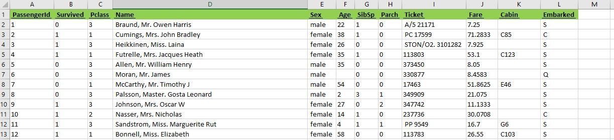
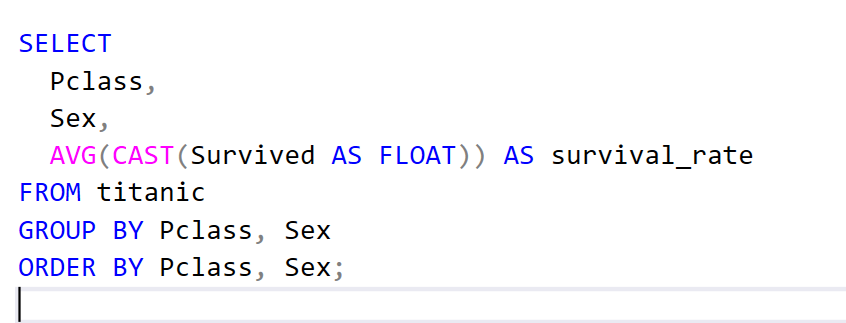
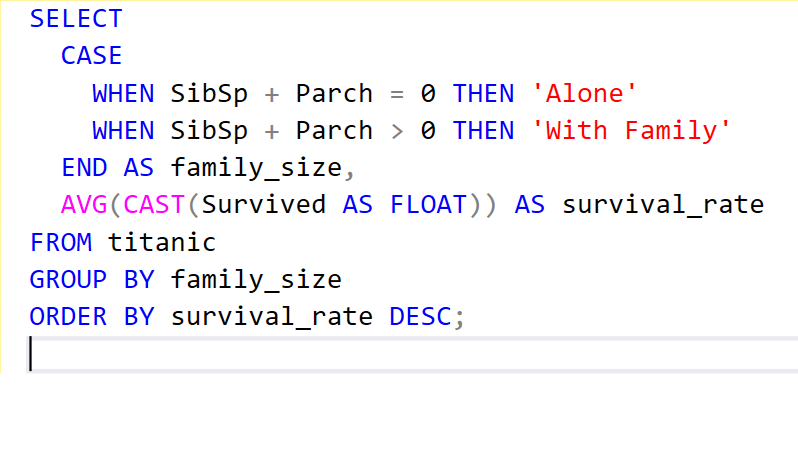
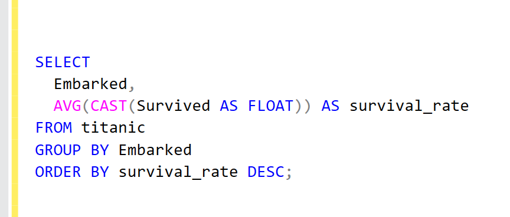
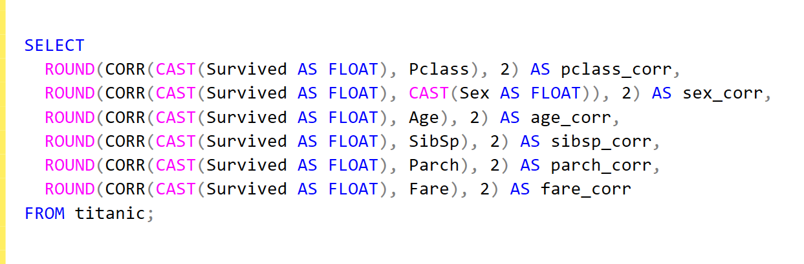

# Titanic Dataset Analysis

## Project Overview
The Titanic dataset contains information about passengers on the ill-fated maiden voyage of the RMS Titanic, including details such as passenger class, gender, age, and survival status. In this project, we will analyze the dataset to gain insights into the factors that influenced the passengers' chances of survival.

## 📚 Dataset
The Titanic dataset can be obtained from various sources, such as Kaggle or GitHub. The dataset typically includes the following columns:
-	PassengerId: Unique identifier for each passenger
-	Survived: Whether the passenger survived (0 = No, 1 = Yes)
-	Pclass: Passenger class (1 = 1st, 2 = 2nd, 3 = 3rd)
-	Name: Passenger's name
-	Sex: Passenger's gender
-	Age: Passenger's age
-	SibSp: Number of siblings/spouses aboard
-	Parch: Number of parents/children aboard
-	Ticket: Ticket number
-	Fare: Passenger fare
-	Cabin: Cabin number
-	Embarked: Port of embarkation (C = Cherbourg, Q = Queenstown, S = Southampton)

Here is a quick snapshot of the data:

## ✏️ Project Objectives

1.	Analyze the survival rates of passengers based on their class, gender, and age.
2.	Investigate the relationship between the number of family members aboard and the chances of survival.
3.	Determine if the passenger's embarkation port had any impact on their survival.
4.	Identify the most important factors that influenced the passengers' chances of survival.

## 📊 Technical - SQL 

1. Survival Rates by Class, Gender, and Age - This query calculates the survival rate for each combination of passenger class and gender
           
  	
2. Survival Rates by Family Size - This query groups passengers by whether they were traveling alone or with family, and calculates the survival rate for each group.
           

3. Survival Rates by Embarkation Port - Calculates the survival rate for passengers based on their port of embarkation
           

4.  Feature Importance Analysis - This query calculates the correlation coefficients between the survival status and various passenger features, which can help identify the most important factors influencing survival
           

    

### 💡 Data Visualization

To complement the SQL queries, we can create the following data visualizations:
1.	Survival Rates by Class, Gender, and Age
-            Create a clustered bar chart or heatmap to visualize the survival rates for different combinations of passenger class, gender, and age.
2.	Survival Rates by Family Size
-           Use a bar chart or pie chart to show the survival rates for passengers traveling alone versus with family.
3.	Survival Rates by Embarkation Port
-           Represent the survival rates for each embarkation port using a bar chart or a map visualization.
4.	Feature Importance Analysis
-           Visualize the correlation coefficients between the survival status and the various passenger features using a correlation matrix or a bar chart

  

### 💡 Conclusion

To complement the SQL queries, we can create the following data visualizations:

This end-to-end SQL project using the Titanic dataset provides valuable insights into the factors that influenced the passengers' chances of survival. The SQL queries and data visualizations demonstrate my ability to:
-	Analyze complex datasets and extract meaningful insights
-	Perform feature engineering and correlation analysis to identify the most important factors
-	Present the findings in a clear and visually appealing manner

The insights gained from this project can be used to better understand the historical events surrounding the Titanic disaster and potentially inform future disaster response strategies. This project showcases my proficiency in SQL, data analysis, and data visualization, which can be valuable for potential employers or clients.

SQL CODE: [Link](https://github.com/dipshisingh31/Titanic_Dataset_Analysis/blob/0b77e128da523649e389398c026319c9dbe54282/TITANIC%20dataset%20analysis.sql)

